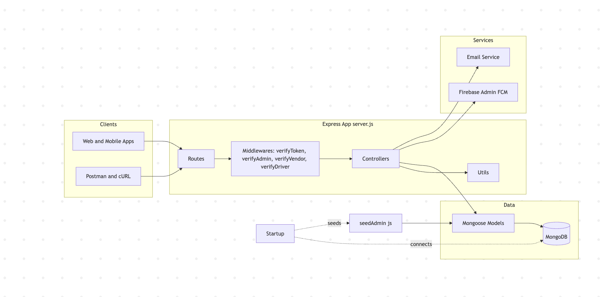
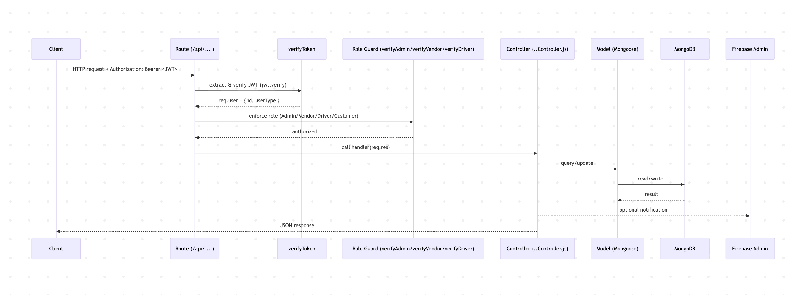
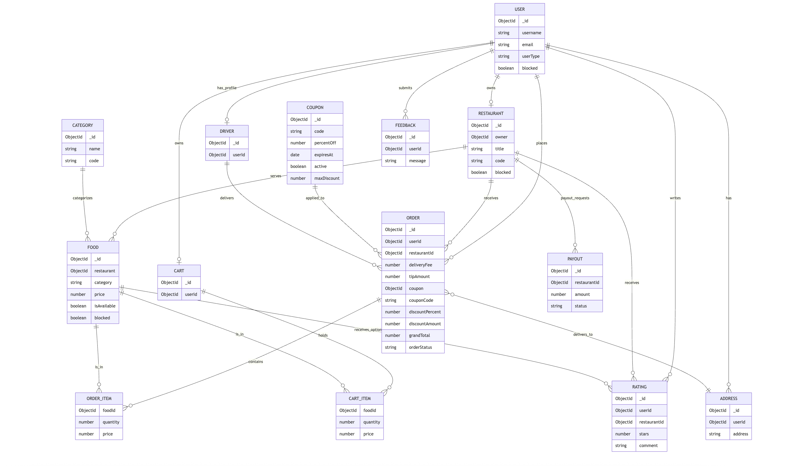

# Food Delivery Service API (Node.js, Express, MongoDB)

Backend API for a food ordering/delivery platform with role-based access control (Admin, Restaurant Owner, Driver, Customer), JWT authentication, and admin tooling for managing users, restaurants, foods, and coupons.

## Features
- JWT authentication with role-based authorization
  - Middlewares: `verifyToken`, `verifyTokenAndAuthorization`, `verifyVendor`, `verifyDriver`, `verifyAdmin`
- Admin capabilities
  - CRUD Users (any role), Restaurants, Foods (meals)
  - Block/unblock Users/Restaurants/Foods
  - Create Coupons (percentage discounts with optional caps/expiry)
  - Built-in admin seeding (non-deletable, non-blockable)
- Orders
  - Supports custom tip (`tipAmount`) and coupon (`couponCode`)
  - Server-side totals via `utils/couponTotalHelper.computeOrderTotals` (prevents client tampering)
- Core modules: Auth, User, Restaurant, Category, Food, Cart, Address, Order
- Firebase Admin integration for notifications

## Tech Stack
- Node.js, Express
- MongoDB (Mongoose)
- JWT (`jsonwebtoken`)
- Firebase Admin SDK

## System Architecture


## Sequence Diagram


## Database Schema


## Getting Started

### Prerequisites
- Node.js 18+
- MongoDB running locally or a connection URI
- A Firebase service account (optional, for notifications)

### Environment
Create a `.env` file in project root:
```
PORT=3000
MONGO_URL=mongodb://localhost:27017/tahil
JWT_SEC=change_me_jwt_secret
SECRET=change_me_crypto_secret
ADMIN_EMAIL=admin@yourapp.com
ADMIN_PASSWORD=ChangeThisNow!

# Firebase (one of the following)
GOOGLE_APPLICATION_CREDENTIALS=/absolute/path/to/serviceAccount.json
# or set FIREBASE_* if your fbConnect utility supports them
```

### Install & Run (macOS)
```bash
cd /Users/tbansal/Projects/Tahil-bansal
npm install
# start (replace with your script if using nodemon)
npm start
node server.js
```
- The built-in admin is seeded once MongoDB connects (email/password from `.env`).

## Project Structure (high level)
```
controllers/
  adminController.js
  authController.js
  categoryController.js
  cartController.js
  foodController.js
  orderController.js
  restaurantController.js
  userController.js

middlewares/
  verifyToken.js

models/
  Address.js
  Cart.js
  Category.js
  Coupon.js
  Driver.js
  FeedBack.js
  Food.js
  Orders.js
  Payout.js
  Restaurant.js
  User.js

routes/
  admin.js
  auth.js
  cart.js
  category.js
  food.js
  order.js
  restaurant.js
  user.js

utils/
  couponTotalHelper.js
  driverUpdate.js
  fbConnect.js
  otpGenerator.js
  payoutRequestEmail.js
  seedAdmin.js
  sendNotification.js
  sendToTopic.js

server.js
```

## Authentication & Authorization
- Clients authenticate via Auth routes to receive a JWT.
- Send the token on protected endpoints:
  - Header: `Authorization: Bearer <JWT>`
- `verifyToken` validates JWT and sets `req.user = { id, userType }`.
- Role gates:
  - `verifyAdmin` → Admin-only
  - `verifyVendor` → Restaurant Owner or Admin
  - `verifyDriver` → Driver or Admin

## Admin API (summary)
Base path: `/api/admin`
- Users: `GET /users`, `GET /users/:id`, `POST /users`, `PUT /users/:id`, `PATCH /users/:id/blocked`, `DELETE /users/:id`
- Restaurants: `GET /restaurants`, `GET /restaurants/:id`, `POST /restaurants`, `PUT /restaurants/:id`, `PATCH /restaurants/:id/blocked`, `DELETE /restaurants/:id`
- Foods: `GET /foods`, `GET /foods/:id`, `POST /foods`, `PUT /foods/:id`, `PATCH /foods/:id/blocked`, `DELETE /foods/:id`
- Coupons: `POST /coupons`

All require Admin JWT.

## Orders (tips and coupons)
- Client may send `tipAmount` (number) and `couponCode` (string).
- Server fetches coupon, validates (active, not expired), caps via `maxDiscount`, and computes:
  - `itemsTotal`, `discountPercent`, `discountAmount`, `grandTotal`
- Stored snapshot fields on Order ensure auditability.

Example (place order):
```json
{
  "userId": "<USER_ID>",
  "orderItems": [{ "foodId": "<FOOD_ID>", "quantity": 2, "price": 9.99 }],
  "deliveryFee": 2.5,
  "tipAmount": 3.0,
  "couponCode": "WELCOME10",
  "paymentMethod": "cash",
  "restaurantId": "<RESTAURANT_ID>",
  "restaurantCoords": { "latitude": 0, "longitude": 0 },
  "recipientCoords": { "latitude": 0, "longitude": 0 },
  "deliveryAddress": "123 Main St",
  "restaurantAddress": "123 Main St"
}
```

## Postman / cURL
- You can import the provided Postman collections (see chat-generated JSON) or use the cURL snippets for each route group (users, restaurants, foods, orders, cart, category).
- Replace `{{baseURL}}` with `http://localhost:8080/api` (or `/api/admin` for admin).

## Notes
- Do not hardcode secrets; always use `.env`.
- Ensure `verifyToken` checks user `blocked` status where appropriate.
- Keep seeding idempotent (see `utils/seedAdmin.js`).